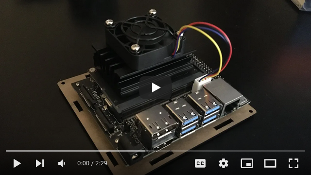

# Machine Learning Piano Pedal

Here is the repo for my piano pedal project. All models are built with pytorch. src/main.py contains the code we run to interface with the piano. All model code is stored in src/models.py. Each model has it's own file associated with it that contains it's training and prediction code (src/train*{algo}.py and predict*{algo}.py). There are some timing tests scattered throghout some of these files.
